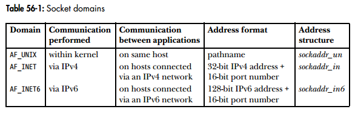

uname -a

<div align="center" style="color:red">VS Code 使用 Markdown 编写文档</div>

[toc]

# 基本语法
##标题等级
\#  一级标题
\## 二级标题
... 以此类推

##生成文档目录
在md中直接输入，即可根据标题等级生成目录
>[toc]

#引用
##单行引用
\> single line
> single line

##多行引用
\> mutliple lines紧跟两次空格（Space）一次回车（Enter）
> multiple lines -1  
multiple lines -2  
multiple lines -3

##嵌套引用
<table><tr><td bgcolor=PowderBlue>
> 第一层 </td></tr>
<tr><td bgcolor=PowderBlue>
>> 第二层 </td></tr>
<tr><td bgcolor=PowderBlue
>>> 第三层 </td></tr></table>

> 1st layer
>> 2nd layer
>>> 3rd layer

#行内标记
<table><tr><td bgcolor=PowderBlue>
first part `#include <stdio.h>` end part</td></tr></table>

first part `marked part` end part

##代码块
用\```代码\```进行包裹
代码：
```
     <div>
        <div></div>
        <div></div>
        <div></div>
    </div>
```

##插入链接
\[链接文字](链接网址 "标题")
语法参照[cnblog](https://www.cnblogs.com/LuckyZLi/p/9776143.html "使用vs code编写Markdown文档以及markdown语法详解")

##插入图片
\!\[链接文字](链接网址 "标题")



